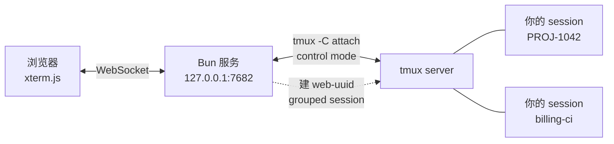

# tmux-next

**在手机上盯着跑在 tmux 里的 Claude Code。**

一个自托管的 tmux web 客户端。列出本机所有 session、看到每个的最后几行输出、点进去接着聊——锁屏、进地铁、换 Wi-Fi 回来，画面自动重建。

```
┌──────────────────────────┐      ┌──────────────────────────┐
│  ● PROJ-1042      2 分钟 │      │ ‹ 会话  PROJ-1042   已连接│
│    要哪个说一声。         │      ├──────────────────────────┤
│    ✻ Cogitated for 1m21s │      │ ✻ Cogitated for 1m 21s   │
│    ❯ rebase 到最新 master│      │                          │
│                      ⋯  │      │ ❯ ▊                      │
├──────────────────────────┤      │                          │
│    billing-ci     1 小时 │      ├──────────────────────────┤
│    ✓ 12 passed           │      │ Esc Tab ⇧Tab Ctrl ⌨ ↑↓←→ │
└──────────────────────────┘      └──────────────────────────┘
         会话列表                          终端
```

左边那个 `●` 是「它在等你回复」——Claude Code 打完一轮会输出 `✻ Cogitated for …`，列表据此把等你的 session 排到最前面。

---

## 它能做什么

| | |
|---|---|
| **会话列表** | 最后几行输出预览、「在等你」状态点、还没发出去的输入、最后活跃时间 |
| **新建会话** | 点选目录（可一路往下钻）、可选会话名、可选跳过权限确认 |
| **终端** | 宽度自适应窗口、软键盘工具条（Esc / Tab / ⇧Tab / Ctrl / 方向键 / ^C / ⏎）、拖动滚动全屏程序 |
| **断线重连** | 不缓冲、不重放——重连时从 tmux 重新抓一次完整画面 |
| **中文输入** | 绕过了 xterm.js 5.5.0 吞掉中文标点的输入守卫 |

## 跑起来

### 前置条件

| | |
|---|---|
| **tmux 3.2+** | 每次 resize 走 `refresh-client -C <列>,<行>`，逗号写法是 3.2 引入的。更早的版本不认这条命令，尺寸会静默不生效——所以启动时会检查版本并拒绝运行 |
| **Bun 1.0+** | 直接跑 TypeScript，没有构建步骤 |
| macOS / Linux | 依赖 tmux 与 POSIX shell |

### 装与跑

用 [Bun](https://bun.sh) 直接跑（**不支持 node** —— 入口是未编译的 TypeScript，没有构建步骤）：

```bash
bunx tmux-next
```

或者克隆下来改：

```bash
git clone https://github.com/niletry/tmux-next.git
cd tmux-next
bun install          # 两个包，都只是前端用的 xterm.js
bun run src/index.ts
```

两种方式都打开 `http://127.0.0.1:7682/`，会列出你本机所有 tmux session。

```
tmux-next [options]

  -p, --port <n>     监听端口（默认 7682）
      --host <addr>  绑定地址（默认 127.0.0.1）
  -h, --help         显示帮助
  -v, --version      显示版本
```

### 从手机访问：必须自己加一层

**这个服务本身没有任何认证**，所以默认只绑 loopback。它假设前面有一个反向代理负责 TLS 和身份验证。

直接 `--host 0.0.0.0` 暴露到网络，等于把一个**无需密码的 shell** 交给任何能连到这个端口的人——它可以附着到你所有 tmux session 并执行命令。程序启动时会为此打印警告，但不会阻止你。

反代需要处理两件事：

1. 普通请求做认证（Basic Auth、OIDC，随你）
2. **WebSocket 单独处理** —— 浏览器发起 WS 握手时**不会带 Basic Auth 头**。可行的做法是普通请求认证成功时种一个 cookie，WS 路径改为校验该 cookie

`docs/deploy.md` 里有一份可用的 Caddy 配置，包含上面这个 cookie 方案。

### 开机自启

仓库里不带 service 文件——路径和用户都因机器而异。macOS 用 launchd plist，Linux 用 systemd unit，命令都是 `bun run /path/to/tmux-next/src/index.ts`。注意 launchd 给的环境极其精简，`tmux` 未必在 `PATH` 里，需要显式指定。

### 开发

```bash
bun test    # 201 个测试，会真的起 tmux session，自动清理
```

运行时只有 xterm.js，没有前端框架、没有构建步骤——`public/` 里的文件浏览器直接加载。

## 它是怎么工作的



核心选择是**用 control mode，而不是起一个 PTY 跑 `tmux attach`**。

control mode 把 tmux 变成一个讲结构化协议的进程：输出按 pane 分发（`%output %3 …`），命令有请求/响应语义。所以这个 app 能只渲染一个 pane，不带 tmux 自己的分屏边框和 status bar——浏览器里看到的就是程序本身的画面。

每个浏览器连接建一个 `web-<uuid>` **grouped session** 当作可销毁的挂载点，断开即销毁。这样它是以一个正常 tmux 客户端的身份参与的，尺寸协商、window 归属这些都交给 tmux 自己仲裁，不必另造一套。

## 几个值得一提的设计

**尺寸是共享的，这是 tmux 的事实而非缺陷。** window 尺寸是 window 的属性，同一个 window 无法对两个客户端渲染成两种宽度。浏览器连上时该 window 会跟随浏览器；断开时调 `resize-window -A` 把尺寸还给剩下的客户端。

**宽度自适应，一条规则覆盖手机和桌面。** 先算「让 80 列铺满窗口需要多大字号」；没超过上限就用它——手机因此永远是 80 列，只是字号跟着屏幕缩。超过上限（约 576px 宽以上）字号就钉在上限，多出来的宽度换成列数。没有设备嗅探，切换点是算出来的。

**拖动滚动的是程序，不是滚动缓冲区。** tmux 原地重绘整个屏幕，从不让行滚出顶部，所以 xterm 的 scrollback 永远是空的。手势被翻译成合成的 `WheelEvent` 交给 xterm，由它按程序协商好的鼠标协议编码——程序不理会鼠标时不会有任何字节被塞进去，而这个「零输出」正好被用作信号，退化成发 PgUp/PgDn。

**命令是常量。** 启动 Claude Code 的字符串会经过 `sh -c`，所以任何来自请求的东西都不允许拼进去——目录作为独立 argv 通过 `-c` 传递，「跳过权限确认」是在两个固定字符串之间二选一，而不是拼接。

**浏览目录没有白名单。** 早期版本把浏览限制在家目录和一个卷内，但那不是真正的边界——能访问这个接口的人本来就能附着到 session 里敲 `ls`。限制浏览却放开 shell 只是自欺，代价却是实打实的：机器特定的路径被写死在源码里。

## 测试

201 个测试，大部分**真的跟 tmux 打交道**——起真实 session、发真实按键、读回 `#{pane_start_command}` 之类的格式串确认参数落到了位。纯逻辑（路径处理、尺寸计算、手势换算、控制协议解析）拆成不含 DOM 的模块单独测。

`public/*.js` 只有浏览器会加载，语法错误不会被任何测试发现——所以有一个测试专门把 `public/` 下每个模块都打包一遍。这个守卫是在真出过两次「测试全绿但页面一打开就炸」之后才加的。

## 文档

- [SECURITY.md](SECURITY.md) — **先读这个**：这个服务没有内置认证，暴露它等于暴露一个 shell
- [docs/deploy.md](docs/deploy.md) — 反向代理、TLS、launchd 服务
- [docs/Caddyfile.reference](docs/Caddyfile.reference) — Caddy 配置结构参考（凭据已替换为占位符）
- `docs/superpowers/` — 设计文档与实现计划

## 许可

[MIT](LICENSE)
