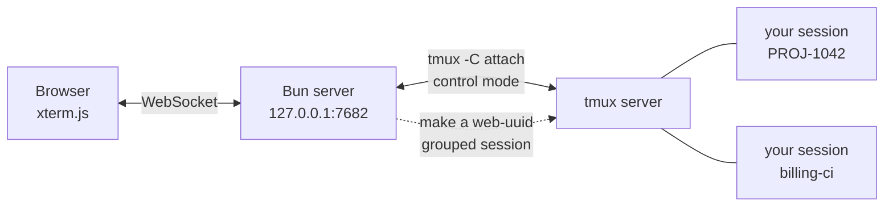

# tmux-next

[](https://github.com/niletry/tmux-next/actions/workflows/ci.yml)
[](https://www.npmjs.com/package/tmux-next)
[](LICENSE)

**English** · [中文](README.zh-CN.md)

**Watch your coding agent — running in tmux — from your phone.**

A self-hosted web client for tmux. List every session on the machine, see the last few lines each one printed, tap in and keep going. Lock the screen, ride the subway, switch Wi-Fi, come back — the screen rebuilds itself.

```
┌──────────────────────────┐      ┌──────────────────────────┐
│  ● PROJ-1042        2 min │      │ ‹ Sessions  PROJ-1042  ● │
│    which one? tell me.    │      ├──────────────────────────┤
│    ✻ Cogitated for 1m21s  │      │ ✻ Cogitated for 1m 21s   │
│    ❯ rebase onto master   │      │                          │
│                        ⋯  │      │ ❯ ▊                      │
├──────────────────────────┤      │                          │
│    billing-ci        1 hr │      ├──────────────────────────┤
│    ✓ 12 passed            │      │ Esc Tab ⇧Tab Ctrl ⌨ ↑↓←→ │
└──────────────────────────┘      └──────────────────────────┘
  session list (sessions.html)              terminal
```

That `●` on the left means "it's waiting on you" — Claude Code prints `✻ Cogitated for …` when a turn ends, and the list uses that to float the sessions waiting on you to the top.

---

## What it does

| | |
|---|---|
| **Work items** | The home page. One card per unit of work — a local task or one claimed from an external tracker like Jira — with the sessions bound to it and a row of dimension chips (status, "waiting on you"/"working", working directory, tags, whatever a plugin adds). Group or filter by any chip; the choices on offer come from whatever's in the data right now, not a fixed list, and your grouping/filter picks are remembered per device |
| **Session list** | A separate tab (`sessions.html`): every tmux session on the machine, what each was last asked to do, a preview of the last lines, a "waiting on you" dot, unsent input, last-active time |
| **Interface language** | English or Chinese, switched from Settings; guessed from the browser on first visit |
| **New session** | Pick an agent (Claude Code / opencode / pi), tap to pick a directory (drill down, or create one on the spot), optional name, optional skip-permissions, or resume a past conversation |
| **Session templates** | Start a session from a work item with its name and first line of input pre-filled from a template — `{item.title}`, `{jira.summary}`, and so on. Created and edited from Settings |
| **Terminal** | Width that adapts to the window, a soft-keyboard toolbar (Esc / Tab / ⇧Tab / Ctrl / arrows / ^C / ⏎), drag to scroll full-screen programs |
| **Reconnect** | No buffering, no replay — a reconnect re-captures the whole screen from tmux |
| **Lock-screen push** | Session ended, a turn finished and it's waiting, or Claude needs confirmation — pushed to your phone (Web Push; needs the hook + a subscription) |
| **Notification history** | Every push is logged, so one swiped away on the phone can still be found |
| **Colour themes** | Seven presets — four dark (Tokyo Night, Catppuccin Mocha, One Dark, Nord) and three light (Tokyo Night Day, Catppuccin Latte, One Light) — switched from Settings, applied without a reload |
| **Voice input** | Speak instead of typing; takes pile up in an editable draft, then go over as one line plus Enter (optional, needs a recognition key) |
| **Artifacts** | Anything dropped in `~/.tmux-next/gallery/` shows up in the UI — images and self-contained HTML render in place |
| **Jira issues** | Optional plugin: see the issues assigned to you, start a session for one with a tap; its status, epic, PRs and checks show up as chips on the issue's work-item card (needs `~/.tmux-next/jira/config.json`) |
| **CJK input** | Works around the xterm.js 5.5.0 guard that swallows CJK punctuation |

## Getting it running

### Prerequisites

| | |
|---|---|
| **tmux 3.2+** | Every resize goes through `refresh-client -C <cols>,<rows>`; the comma form arrived in 3.2. Older tmux doesn't understand it and silently never resizes — so startup checks the version and refuses to run |
| **Bun 1.0+** | Runs the TypeScript directly, no build step |
| macOS / Linux | Depends on tmux and a POSIX shell |

### Install and run

Run it straight with [Bun](https://bun.sh) (**node is not supported** — the entry point is uncompiled TypeScript, there is no build step):

```bash
bunx tmux-next
```

Or clone it to hack on:

```bash
git clone https://github.com/niletry/tmux-next.git
cd tmux-next
bun install          # two packages, both just xterm.js for the front-end
bun run src/index.ts
```

Either way, open `http://127.0.0.1:7682/` and land on the work-item list; the "Sessions" tab lists every tmux session on the machine.

```
tmux-next [options]

  -p, --port <n>     port to listen on (default 7682)
      --host <addr>  address to bind (default 127.0.0.1)
  -h, --help         show help
  -v, --version      show the version
```

### Reaching it from your phone: you must add a layer

**This service has no authentication of its own**, so it binds to loopback by default. It assumes a reverse proxy in front doing TLS and auth.

Exposing it with `--host 0.0.0.0` hands a **password-less shell** to anyone who can reach the port — they can attach to every one of your tmux sessions and run commands. The program prints a warning for this at startup but won't stop you.

The proxy needs to handle two things:

1. Authenticate normal requests (Basic Auth, OIDC, whatever you like).
2. **Handle the WebSocket separately** — the browser's WS handshake **won't carry a Basic Auth header**. A working approach: set a cookie when a normal request authenticates, and have the WS path check that cookie instead.

`docs/deploy.md` has a working Caddy config that includes this cookie scheme.

### Start on boot

The repo ships no service file — paths and users differ per machine. Use a launchd plist on macOS, a systemd unit on Linux; the command is `bun run /path/to/tmux-next/src/index.ts`. Note that launchd gives a very bare environment where `tmux` may not be on `PATH`, so point at it explicitly.

### Getting around

The work-item list (home), the session list, artifacts and notifications are siblings, so every page carries the same header: a segmented control to switch between them on the left, and the actions — notification subscription, settings, new session — on the right. The count for the page you are on sits inside its own segment.

Starting a session is a page of its own rather than a sheet. Browsing directories needs the height, the three input fields need somewhere for the soft keyboard to push, and the directory you are in lives in the URL — so the back button walks up the path you came down instead of discarding it, and `new.html?dir=/some/project` can be kept as a link.

### Three agents

Claude Code, [opencode](https://opencode.ai) and [pi](https://github.com/earendil-works/pi) are supported to the same depth: starting, resuming, the task line, and lock-screen notifications. The picker in the new-session sheet only appears when more than one is installed, so a machine with just Claude Code looks exactly as it did.

Agents are probed through a login shell — the same way a launch resolves the command — and one that is not on that PATH is shown struck through rather than offered. This matters more than it sounds: `tmux new-session` happily creates a session for a command that does not exist, so without the check you get a session that vanishes the instant it appears, with nothing said.

The parts that differ between agents are narrow, and they live in `src/agents/`:

| | Resume | Sessions stored as | Task line comes from |
|---|---|---|---|
| Claude Code | `--resume <uuid>` | JSONL under `~/.claude/projects/` | its `last-prompt` record |
| pi | `--session <uuid>` | JSONL under `~/.pi/agent/sessions/` | the newest user message |
| opencode | `--session <ses_…>` | **SQLite** | `session.title`, already a summary |

Notifications are shaped differently too. Claude Code runs external shell hooks; the other two load a module into their own process, so `bunx tmux-next hook` installs those as well. pi discovers its extension directory on its own; opencode additionally needs the path added to the `plugin` array in `opencode.json`, which is left to you because that file holds your provider credentials.

### Session restore (bring Claude sessions back after tmux restarts)

When the tmux server dies (a reboot, a crash, `tmux kill-server`), the Claude sessions inside it are gone. Install the companion SessionStart hook and tmux-next can restore them afterward:

```bash
bunx tmux-next hook
```

It drops a hook script into `~/.claude/hooks/` and registers it in `~/.claude/settings.json` (backing the file up first, idempotent, never clobbering your existing config). From then on every Claude **newly started** in tmux records `{name, id, cwd}` under `~/.tmux-next/sessions/` (on disk, so it survives the tmux server dying — Claude's own transcript is on disk anyway).

After tmux restarts, the list shows "N sessions can be restored" at the top; tap it and tmux-next rebuilds each with `tmux new-session -c <cwd>` and `claude --resume <id>`, and the conversation is back. Needs `jq`. Only applies to Claude started afterward; sessions you deliberately kill via tmux-next's "end session" are not offered for restore.

### Lock-screen notifications (ended / waiting / needs confirmation)

You hand a task to Claude in tmux, go do something else, and only later find it stopped ages ago — notifications close that gap. Standard Web Push: your phone gets a system notification even locked or with the app closed, and tapping it jumps straight to that session.

Installing the notify hooks is the **same command** (it installs both the restore hook and the notify hooks at once):

```bash
bunx tmux-next hook       # or, from a clone: bun run src/index.ts hook
```

It drops the hook scripts into `~/.claude/hooks/` and registers four events in `~/.claude/settings.json` (`SessionStart` for restore; `Stop`/`SessionEnd`/`Notification` for notifications) — backed up, idempotent, non-clobbering. From then on a Claude **newly started** in tmux POSTs the event to the local tmux-next at those three moments. Needs `jq` and `curl`.

Then **subscribe once** in the web UI: tap the bell at the top-right of the list and allow notifications (the bell lights up when subscribed). A few requirements:

- **HTTPS is required** (or `localhost`) — browsers only grant notification permission in a secure context. Reaching it through the reverse proxy satisfies this; plain `http://…` over the LAN does not.
- **iPhone** must first "Add to Home Screen" as a PWA and subscribe from that icon (iOS only pushes to installed PWAs, iOS 16.4+).
- The VAPID keypair is generated on first use at `~/.tmux-next/vapid.json`; subscriptions live in `~/.tmux-next/push-subscriptions/`. No third-party account involved.

At most one push per session per 30 seconds (session-end is exempt). The `/api/notify` endpoint that triggers a push accepts loopback callers only, so no one can spoof one.

Every hook invocation is logged to `~/.tmux-next/hook-events.jsonl`: which kind
of event arrived, whether it came from a subagent, which session it was
attributed to, and whether a push followed. That shape only — never the message
text. It exists because each way the hook declines to act is silent by design,
which is what made two bugs hard to find. `TMUX_NEXT_HOOK_LOG=off` records
nothing; a path puts it elsewhere.

**After upgrading the package, re-run `bunx tmux-next hook`.** The scripts are *copied* into `~/.claude/hooks/`, so npm cannot update them in place. A stale hook fails silently — that is what hooks are built to do — taking session restore and push notifications with it, so the server checks at startup and prints a line if the installed copies differ from the ones it ships.

### Seeing what each session is working on

The list shows the last thing each conversation was asked to do, above its screen preview. Mid-task the preview is usually tool output scrolling past — it says what is happening, not what it is for.

The text comes from the `last-prompt` record Claude Code keeps in its transcript, read from the tail of the file: transcripts reach tens of megabytes, and a 32 KB tail was measured to find the record in 94.8% of the 192 on the development machine. Sessions with no binding record — or from before Claude Code wrote that record — simply show no task line.

This needs the hook (`bunx tmux-next hook`), which is what ties a tmux session to its conversation id.

### Work items and session bindings

A work item is the unit of work — a session is just a means to it, and a single item can have several. `~/.tmux-next/items.json` holds them; `~/.tmux-next/bindings.json` holds which tmux session (by name and by its stable `#{session_id}`, so a rename doesn't lose the link) belongs to which item. An item can stand alone or carry a `source` such as a claimed Jira issue — a plain item and a Jira-backed one are the same kind of row.

On first startup, if `items.json` does not exist yet, tmux-next migrates any bindings already made through the Jira plugin's old private store into these two files — a one-time, idempotent move that leaves the old file in place rather than deleting it.

### Syncing, refreshing, and archiving items

The **Sync** button on the work-item list asks every enabled plugin that's backed by an external tracker to pull its issues and create or update the matching items; with no tracker configured it comes back reporting zero rather than failing. A single item with a `source` also gets its own **Refresh** button, for re-checking just that one issue's status, PRs, and checks without paying for a full sync — an item with no `source` (a local, unclaimed one) shows no refresh button at all. Any item can be archived and unarchived from its card; the toolbar's "Show archived" checkbox toggles whether archived items are included in the list.

### Session templates

Starting a session from a work item's card can offer a template picker: pick one, and it fills in the session name and the first line of input before you even reach the new-session page, using placeholders like `{item.title}`, `{item.ref}`, or a plugin's own fields (`{jira.summary}`, `{jira.description}`). A line whose only placeholders all came back empty is dropped rather than left half-written; a line with no placeholders is always kept. Templates are created and edited from Settings, where the available placeholders are listed for you to tap in — there are none until you add one, and with none defined the picker doesn't appear at all.

### Grouping and filtering the work-item list

Each item's card carries a row of chips — `waiting`/`working`/`none`, its session count, its working directory, its tags, and anything a plugin has attached (Jira's status, epic, PRs, checks). Every chip is a `{ dimension, value }` pair, and the home page groups or filters by whichever dimension you pick; the choices on offer are read straight off the current cards, not a hard-coded list, so a new plugin dimension shows up without any change to the page itself. Your grouping and filter choices are remembered per device, not synced. An item with no bound sessions still gets an ordinary card — its `item.agent` chip just reads `none`, and it groups and filters like any other. The "unassigned" group at the bottom of the list is the other direction: tmux sessions that aren't bound to any item at all, not items missing a session.

### Interface language

English and Chinese. On a machine that has never chosen one, the first request guesses from the browser's `Accept-Language` and stores that — so arriving from npm gives you a first screen you can read, without touching a setting. Change it under the gear icon; the choice is stored per machine (`~/.tmux-next/language.json`) so phone and desktop agree.

Lock-screen notifications follow it too. A push is the one piece of text that shows up away from the interface, so an English interface with a Chinese lock screen would be the odd one out. A message the agent itself sent is passed through untranslated — it is more specific than anything canned, and already in the language the agent chose.

### Colour themes

Tap the gear in the list header. Seven presets ship, in two groups: four dark — Tokyo Night (default), Catppuccin Mocha, One Dark, Nord — and three light — Tokyo Night Day, Catppuccin Latte, One Light. Each is shown with its palette and a sample before you pick, and the change applies immediately, no reload. There is no Nord light: Nord ships no upstream light variant, and inventing one would mean re-picking half its hues with nothing to check the result against.

The terminal's palette and the interface's are chosen separately — Settings has a section for each — so a light interface can wrap a dark terminal, or the other way round. Both choices are stored per machine (`~/.tmux-next/theme.json`), so phone and desktop agree. Font size stays per device, on the terminal toolbar — how big a screen is and what a machine looks like are different questions.

Every palette is checked against WCAG AA by the test suite. Note that six of the seven do **not** use their upstream `brightBlack`: each of those ships one between 1.7:1 and 2.6:1 against its own background, and that is the colour Claude Code draws its secondary text in — unreadable on a phone outdoors. Each is replaced by a step from the same upstream palette moved away from the background — lighter on a dark theme, darker on a light one. Catppuccin Latte is the exception: its upstream value already clears the bar.

### Virtual keys

The terminal toolbar's keys sit in three rows — the always-visible one (Esc, Tab, arrows, Enter), an editing row (Ctrl, ^C, ← →) and a tools row (image, paste, copy, font size) — and where each key sits is yours: the gear on the list page opens Settings → **Reorder**, where the keys are shown as they really sit, three rows of tiles like the bar itself. Press a key and drag it anywhere on the board — across rows too — the others sliding out of the way, the same gesture as arranging home-screen icons. The tap count each key has earned on this machine sits beside it as a badge, so the order can be chosen from evidence instead of guesswork. **Reset** puts the bar back to the default.

The arrangement is saved per device (localStorage), like font size: how the keys sit on the screen you are holding is a property of that screen. The ▴ toggle always stays at the front of the always-visible row.

### Voice input (optional)

Dictating a prompt beats typing one on a phone. The system keyboard's own
dictation key cannot work here — iOS rewrites the whole text repeatedly and
xterm.js treats every rewrite as fresh keystrokes, so "voice input" arrives as
"voivoice invoice input" — so tmux-next records the audio itself and sends it to
Volcano Engine for recognition.

It is off until you give it a key:

```bash
bunx tmux-next asr <key>
```

The key lives in `~/.tmux-next/asr.json` (mode 0600) as a single JSON object:

```json
{ "key": "your-key", "resourceId": "volc.bigasr.auc_turbo" }
```

`resourceId` picks the recognition model; the default (`volc.bigasr.auc_turbo`)
is right unless you know you want another. Editing the file by hand works just
as well as the command — point the same key at a newer model by changing only
`resourceId`.

No restart is needed: the server reads the file on every request, so once it's
there, reloading the terminal page shows the microphone. To switch keys, run the
command again (or rewrite the file); to turn voice input off, delete it. Without
the file, the microphone button never appears.

Tap the microphone in the terminal toolbar and the panel takes the soft
keyboard's place — there is only room for one of them. One button starts and
stops; there is no time limit.

Takes accumulate into an editable draft rather than going to the terminal one at
a time, because speech arrives in bursts: say a sentence, check what landed, say
the next, fix a name the recogniser got wrong. Send delivers the whole draft and
presses Enter, then the panel stays open for the next one.

The audio goes to the server and straight upstream; it is never written to
disk. The key never leaves the machine — the browser talks only to tmux-next,
because recognition with a single key needs a header that is not in the
provider's CORS allow-list. Recognition is a paid Volcano Engine service and is
billed to your account. Recording needs a secure context, so reach the page
through the HTTPS reverse proxy, not plain `http://` over the network.

### Development

```bash
bun test    # 300+ tests; they start real tmux sessions and clean up after themselves
```

The only runtime dependency is xterm.js — no front-end framework, no build step; the files under `public/` load straight into the browser.

## How it works



The core choice is **control mode, rather than a PTY running `tmux attach`**.

Control mode turns tmux into a process that speaks a structured protocol: output is dispatched per pane (`%output %3 …`), and commands have request/response semantics. That lets the app render a single pane with none of tmux's own split borders or status bar — what you see in the browser is the program's own screen.

Each browser connection makes a `web-<uuid>` **grouped session** as a disposable mount point, destroyed on disconnect. That way it participates as an ordinary tmux client, and size negotiation and window ownership are arbitrated by tmux itself rather than reinvented.

## A few design notes worth mentioning

**Size is shared — that's a fact of tmux, not a bug.** A window's size is a property of the window; the same window can't render at two widths for two clients. When a browser connects the window follows it; on disconnect `resize-window -A` hands the size back to whoever is left.

**Adaptive width, one rule for phone and desktop.** First compute "what font size makes 80 columns fill the window"; if that's under the cap, use it — so a phone is always 80 columns, just with the font scaled to the screen. Above the cap (roughly 576px wide and up) the font pins to the cap and the extra width becomes more columns. No device sniffing; the switch point is computed.

**Drag scrolls the program, not a scrollback buffer.** tmux redraws the whole screen in place and never lets a line scroll off the top, so xterm's scrollback is always empty. Gestures are translated into synthetic `WheelEvent`s handed to xterm, which encodes them per the mouse protocol the program negotiated — nothing is injected when the program ignores the mouse, and that "zero output" is used as the signal to fall back to PgUp/PgDn.

**The command is a constant.** The string that launches Claude Code goes through `sh -c`, so nothing from a request may be spliced into it — the directory travels as its own argv via `-c`, and "skip permissions" is a choice between two fixed strings, not concatenation.

**No allow-list for directory browsing.** An early version fenced browsing to the home directory and one volume, but that isn't a real boundary — anyone who can reach this interface can already attach to a session and type `ls`. Fencing the browser while leaving the shell open only fools you, and it costs something real: machine-specific paths hard-coded into the source.

## Testing

300+ tests, most of which **really talk to tmux** — starting real sessions, sending real keys, reading back format strings like `#{pane_start_command}` to confirm the arguments actually landed. Pure logic (path handling, size math, gesture translation, control-protocol parsing, Web Push encryption) is split into DOM-free modules tested on their own.

`public/*.js` is only ever loaded by the browser, and a syntax error there wouldn't be caught by any test — so one test bundles every module under `public/`. That guard was added after two real "all green but the page explodes on open" incidents.

## Docs

- [SECURITY.md](SECURITY.md) — **read this first**: the service has no built-in auth, and exposing it exposes a shell
- [docs/deploy.md](docs/deploy.md) — reverse proxy, TLS, launchd service
- [docs/Caddyfile.reference](docs/Caddyfile.reference) — Caddy config structure reference (credentials replaced with placeholders)
- `docs/superpowers/` — design docs and implementation plans

## License

[MIT](LICENSE)
