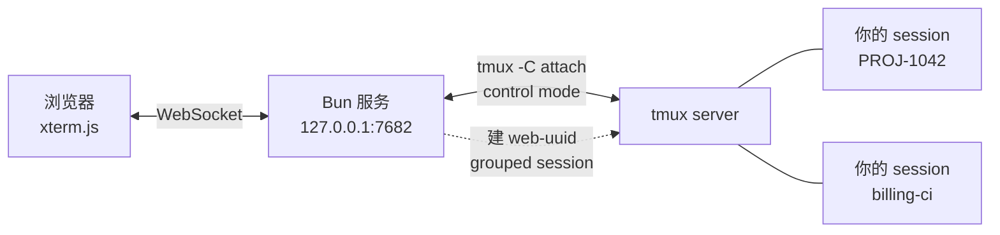

# tmux-next

[](https://github.com/niletry/tmux-next/actions/workflows/ci.yml)
[](https://www.npmjs.com/package/tmux-next)
[](LICENSE)

[English](README.md) · **中文**

**在手机上盯着 tmux 里跑的编码 agent。**

一个自托管的 tmux web 客户端。列出本机所有 session、看到每个的最后几行输出、点进去接着聊——锁屏、进地铁、换 Wi-Fi 回来，画面自动重建。

```
┌──────────────────────────┐      ┌──────────────────────────┐
│  ● PROJ-1042      2 分钟 │      │ ‹ 会话  PROJ-1042   已连接│
│    要哪个说一声。         │      ├──────────────────────────┤
│    ✻ Cogitated for 1m21s │      │ ✻ Cogitated for 1m 21s   │
│    ❯ rebase 到最新 master│      │                          │
│                      ⋯  │      │ ❯ ▊                      │
├──────────────────────────┤      │                          │
│    billing-ci     1 小时 │      ├──────────────────────────┤
│    ✓ 12 passed           │      │ Esc Tab ⇧Tab Ctrl ⌨ ↑↓←→ │
└──────────────────────────┘      └──────────────────────────┘
  会话列表（sessions.html）              终端
```

左边那个 `●` 是「它在等你回复」——Claude Code 打完一轮会输出 `✻ Cogitated for …`，列表据此把等你的 session 排到最前面。

---

## 它能做什么

| | |
|---|---|
| **单列表** | 首页。每张单一张卡片——本地任务，或从 Jira 之类外部系统认领来的——挂着它绑定的会话，还有一行维度 chip（状态、「等你」/「在跑」、工作目录、标签，以及插件贴上来的任何东西）。可以按任意 chip 分组或筛选；可选项从当前数据现算，不是写死的列表；分组/筛选的选择逐设备记住 |
| **会话列表** | 单独一个 tab（`sessions.html`）：本机所有 tmux 会话，每个最近被要求做什么、最后几行输出预览、「在等你」状态点、还没发出去的输入、最后活跃时间 |
| **界面语言** | 中英文，设置里切换；首次访问按浏览器语言猜 |
| **新建会话** | 选 agent（Claude Code / opencode / pi）、点选目录（可一路往下钻，也可当场新建）、可选会话名、可选跳过权限确认、可从历史对话恢复 |
| **终端** | 宽度自适应窗口、软键盘工具条（Esc / Tab / ⇧Tab / Ctrl / 方向键 / ^C / ⏎）、拖动滚动全屏程序 |
| **断线重连** | 不缓冲、不重放——重连时从 tmux 重新抓一次完整画面 |
| **锁屏通知** | 会话结束、一轮聊完在等你、Claude 要你确认时，推到手机锁屏（Web Push，需装 hook + 订阅） |
| **通知历史** | 每条推送都落盘，手机上划掉了还能在这里翻到 |
| **配色主题** | 七套预设，深色四套（Tokyo Night / Catppuccin Mocha / One Dark / Nord）、浅色三套（Tokyo Night Day / Catppuccin Latte / One Light），设置页切换，无需刷新 |
| **语音输入** | 说话代替打字，多段识别攒成可编辑草稿，改完一次发出并回车（可选，需要识别 key） |
| **制品库** | 丢进 `~/.tmux-next/gallery/` 的东西会出现在界面里，图片和自包含 HTML 直接就地渲染 |
| **Jira 工单** | 可选插件：看分给你的工单，点一下就为某个单开会话；它的状态、史诗、PR 与检查会作为 chip 贴在这张单的卡片上（需要 `~/.tmux-next/jira/config.json`） |
| **中文输入** | 绕过了 xterm.js 5.5.0 吞掉中文标点的输入守卫 |

## 跑起来

### 前置条件

| | |
|---|---|
| **tmux 3.2+** | 每次 resize 走 `refresh-client -C <列>,<行>`，逗号写法是 3.2 引入的。更早的版本不认这条命令，尺寸会静默不生效——所以启动时会检查版本并拒绝运行 |
| **Bun 1.0+** | 直接跑 TypeScript，没有构建步骤 |
| macOS / Linux | 依赖 tmux 与 POSIX shell |

### 装与跑

用 [Bun](https://bun.sh) 直接跑（**不支持 node** —— 入口是未编译的 TypeScript，没有构建步骤）：

```bash
bunx tmux-next
```

或者克隆下来改：

```bash
git clone https://github.com/niletry/tmux-next.git
cd tmux-next
bun install          # 两个包，都只是前端用的 xterm.js
bun run src/index.ts
```

两种方式都打开 `http://127.0.0.1:7682/`，落地页是单列表；「会话」这个 tab 里能看到本机所有 tmux session。

```
tmux-next [options]

  -p, --port <n>     监听端口（默认 7682）
      --host <addr>  绑定地址（默认 127.0.0.1）
  -h, --help         显示帮助
  -v, --version      显示版本
```

### 从手机访问：必须自己加一层

**这个服务本身没有任何认证**，所以默认只绑 loopback。它假设前面有一个反向代理负责 TLS 和身份验证。

直接 `--host 0.0.0.0` 暴露到网络，等于把一个**无需密码的 shell** 交给任何能连到这个端口的人——它可以附着到你所有 tmux session 并执行命令。程序启动时会为此打印警告，但不会阻止你。

反代需要处理两件事：

1. 普通请求做认证（Basic Auth、OIDC，随你）
2. **WebSocket 单独处理** —— 浏览器发起 WS 握手时**不会带 Basic Auth 头**。可行的做法是普通请求认证成功时种一个 cookie，WS 路径改为校验该 cookie

`docs/deploy.md` 里有一份可用的 Caddy 配置，包含上面这个 cookie 方案。

### 开机自启

仓库里不带 service 文件——路径和用户都因机器而异。macOS 用 launchd plist，Linux 用 systemd unit，命令都是 `bun run /path/to/tmux-next/src/index.ts`。注意 launchd 给的环境极其精简，`tmux` 未必在 `PATH` 里，需要显式指定。

### 在页面之间走动

单列表（首页）、会话列表、制品、通知是平级的几页，所以每页顶栏都一样：左边是切换用的分段控件，右边是操作——通知订阅、设置、新建会话。当前页的计数就显示在它自己那一段里。

新建会话是独立页面而不是弹层。浏览目录需要高度，三个输入框需要给软键盘让位，而且所在目录写在 URL 里——后退键沿着你钻下去的路径一层层退回，而不是把它整个丢掉；`new.html?dir=/some/project` 也能当链接存下来。

### 三种 agent

Claude Code、[opencode](https://opencode.ai) 和 [pi](https://github.com/earendil-works/pi) 支持到同样的深度：新建、恢复、任务行、锁屏通知。新建弹层里的选择器只在装了不止一种时才出现，所以只有 Claude Code 的机器看到的界面和以前一样。

agent 是通过 login shell 探测的——和启动时解析命令的方式一致——不在那条 PATH 上的会被划掉而不是照样提供。这比听上去要紧：`tmux new-session` 对一条不存在的命令照样建会话，没有这层检查你会得到一个刚出现就消失的会话，而且什么提示都没有。

各 agent 之间真正不同的地方很窄，都收在 `src/agents/` 里：

| | 恢复 | 会话存储 | 任务行来源 |
|---|---|---|---|
| Claude Code | `--resume <uuid>` | `~/.claude/projects/` 下的 JSONL | 它的 `last-prompt` 记录 |
| pi | `--session <uuid>` | `~/.pi/agent/sessions/` 下的 JSONL | 最新一条用户消息 |
| opencode | `--session <ses_…>` | **SQLite** | `session.title`，本身就是摘要 |

通知的形态也不同。Claude Code 用的是外部 shell hook；另外两家把模块加载进自己的进程，所以 `bunx tmux-next hook` 会一并装好。pi 会自动发现它的扩展目录；opencode 还需要把路径加进 `opencode.json` 的 `plugin` 数组——这一步留给你自己做，因为那个文件里存着你的 provider 凭据。

### 会话恢复（tmux 重启后找回 Claude 会话）

tmux server 一死（重启、崩溃、`tmux kill-server`），里面跑着的 Claude 会话就没了。装上配套的 SessionStart hook，tmux-next 就能在事后把它们恢复回来：

```bash
bunx tmux-next hook
```

它把 hook 脚本装进 `~/.claude/hooks/`，并在 `~/.claude/settings.json` 里注册（改动前备份、幂等、不覆盖你已有配置）。之后每个在 tmux 里**新启动**的 Claude，会把 `{会话名, 会话 id, cwd}` 记到 `~/.tmux-next/sessions/`（磁盘上，扛得过 tmux 死——Claude 的对话记录本就在磁盘上）。

tmux 重启后打开列表，顶部会出现「N 个上次的会话可恢复」；点一下，tmux-next 用 `tmux new-session -c <cwd>` 重建会话并 `claude --resume <id>`，对话就回来了。需要机器上有 `jq`。只对之后新起的 Claude 生效；用 tmux-next「结束会话」主动杀掉的不会被提示恢复。

### 锁屏通知（会话结束/在等你/需要确认时提醒）

把任务丢给 tmux 里的 Claude 然后去忙别的，回来才发现它早停了——通知补的就是这段。走标准 Web Push，手机锁屏、app 关着也能收到系统通知，点通知直接跳到那个会话。

装通知 hook 用的是**同一条命令**（它一次装好恢复用的和通知用的全部 hook）：

```bash
bunx tmux-next hook       # 或从克隆的仓库：bun run src/index.ts hook
```

它把 hook 脚本装进 `~/.claude/hooks/`，在 `~/.claude/settings.json` 注册四个事件（`SessionStart` 用于恢复；`Stop`/`SessionEnd`/`Notification` 用于通知），改动前备份、幂等、不覆盖你已有配置。之后**新起**的 tmux 里的 Claude 会话，在这三个时机会把事件 POST 给本机的 tmux-next。需要 `jq` 与 `curl`。

然后在 web 界面**订阅一次**：列表页右上角点铃铛，允许通知即可（铃铛变亮＝已订阅）。几个前提：

- **必须 HTTPS**（或 `localhost`）——浏览器只在安全上下文里给通知权限。经反向代理访问天然满足；局域网明文 `http://…` 不行。
- **iPhone** 需先把页面「添加到主屏幕」当 PWA，从那个图标进去再订阅（iOS 只对已安装 PWA 推送，需 iOS 16.4+）。
- VAPID 密钥首次自动生成存 `~/.tmux-next/vapid.json`，订阅存 `~/.tmux-next/push-subscriptions/`，无需任何第三方账号。

同一会话 30 秒内最多推一条（会话结束不受限）。触发通知的 `/api/notify` 只接受本机来源，别人无法伪造。

每次钩子被调用都会记进 `~/.tmux-next/hook-events.jsonl`：来的是哪类事件、是不是来自
子 agent、归到了哪个会话、有没有真的推送出去。只记这些形状，**不记消息内容**。它存在
的理由是：这个钩子每一条「决定不做事」的路径都是刻意静默的，而那正是两个 bug 难找的
原因。设 `TMUX_NEXT_HOOK_LOG=off` 完全不记，设成路径可以换地方。

### 一眼看出每个会话在做什么

列表里每个会话会显示它最近被要求做的事，位置在屏幕预览上方。任务进行中时预览多半是滚动的工具输出——它说明「正在发生什么」，说明不了「这是为了什么」。

文字取自 Claude Code 记在 transcript 里的 `last-prompt`，从文件尾部读：transcript 能到几十 MB，而实测本机 192 个 transcript，尾部 32 KB 就能命中 94.8%。没有绑定记录的、或早于该记录存在的老会话，就不显示这一行。

这个功能依赖 hook（`bunx tmux-next hook`）——是它把 tmux 会话和对话 id 绑在一起的。

### 单与会话绑定

单是工作的单位，会话只是达成它的手段之一——同一张单可以挂着不止一个会话。`~/.tmux-next/items.json` 存这些单；`~/.tmux-next/bindings.json` 存哪个 tmux 会话（按名字，也按它不随改名变化的 `#{session_id}`，这样改名不会丢掉关联）挂在哪张单下面。一张单可以是本地的，也可以挂着来源——比如一个认领了的 Jira 工单；本地单和挂了工单的单是同一种行，没有区别对待。

首次启动时，如果 `items.json` 还不存在，tmux-next 会把之前通过 Jira 插件私有存储做的那些绑定迁移进这两个文件——一次性、幂等，且不会删掉旧文件。

### 同步、刷新单张、归档

单列表上的**同步**按钮会让每个已启用、背靠外部系统的插件各拉一遍工单，新建或更新对应的单；没配置任何外部系统时，它如实报零个而不是报错。挂着来源的单还各自带一个**刷新**按钮，只重新查这一张单的状态、PR、检查，不必付一次全量同步的代价——没有来源的本地单不画这个按钮。任何一张单都能从卡片上归档、取消归档；工具栏的「显示已归档」勾选框决定列表里要不要带上已归档的单。

### 单列表的分组与筛选

每张单的卡片上有一行 chip：`waiting`/`working`/`none`、绑定的会话数、工作目录、标签，以及插件贴上来的任何东西（Jira 的状态、史诗、PR、检查）。每个 chip 都是一对 `{ 维度, 取值 }`，首页可以按选中的维度分组或筛选；可选项直接从当前卡片上现读，不是写死的表，所以一个新插件维度冒出来不需要改这个页面。分组和筛选的选择逐设备记住，不跨设备同步。没有绑定任何会话的单也照样是一张普通卡片，只是 `item.agent` 这个 chip 显示 `none`，分组筛选跟其他卡片一样对待。列表最下面的「未归单」是反过来的：那是没绑到任何单的 tmux 会话，不是没有会话的单。

### 界面语言

中文和英文。从没选过的机器上，第一次请求会按浏览器的 `Accept-Language` 猜一次并存下来——从 npm 装完打开就是能读的语言，不用先去翻设置。之后在齿轮里改，选择按机器存（`~/.tmux-next/language.json`），手机和桌面一致。

锁屏通知也跟着走。推送是唯一会脱离界面出现的文本，界面英文而锁屏中文最突兀。agent 自己发来的消息原样透传、不翻译——它比任何预设文案都具体，而且已经是 agent 选择的语言。

### 配色主题

点列表顶栏的齿轮。内置七套，分两组：深色四套——Tokyo Night（默认）、Catppuccin Mocha、One Dark、Nord；浅色三套——Tokyo Night Day、Catppuccin Latte、One Light。每套都带色板和一段样例，选之前就知道长什么样，点了立刻生效，不用刷新。没有 Nord 浅色版：Nord 没有官方浅色配色，自己造一套意味着重挑一半色相，而且没有任何上游可以拿来对照。

终端画布和页面界面分开选——设置页各有一节——所以浅色的界面可以裹着深色的终端，反过来也行。两个选择都按机器存（`~/.tmux-next/theme.json`），手机和桌面保持一致；字号仍按设备存、在终端页工具条上调——「这块屏幕多大」和「这台机器长什么样」是两回事。

每套配色都由测试按 WCAG AA 校验。要说明的是，七套里有六套**没有**沿用各自官方的 `brightBlack`：它们相对自身背景只有 1.7:1 到 2.6:1，而那正是 Claude Code 用来画次要信息的颜色，手机拿到户外根本看不清。各自换成了同一官方色板里朝远离背景方向挪一档的颜色——深色主题往亮里挪，浅色主题往暗里挪。Catppuccin Latte 是例外，它的官方取值本来就过线。

### 虚拟按键

终端工具条的按键分三行——常显行（Esc、Tab、方向键、回车）、编辑行（Ctrl、^C、← →）、工具行（图片、粘贴、复制、字号）——每个键放在哪里由你说了算：列表页齿轮 → 设置 → **调整顺序**，按键按真实排列展开成三行方块（和工具条本身一样），按住某个键在整块面板上任意拖动（跨行也行），其他键让开——跟整理手机主屏图标同一个手势。角标显示它在当前设备上被点过多少次，按证据排而不是靠猜。**恢复默认**把工具条还原成出厂顺序。

排列按设备保存（localStorage），和字号一样：「按键在手上这块屏幕怎么放」是这块屏幕的事。▴ 展开键永远固定在常显行最前面。

### 语音输入（可选）

手机上说一句比打一句快。系统输入法自带的语音键在这里用不了——iOS 会把整段文本反复
重写，而 xterm.js 把每次重写都当成新按键，「语音输入」会变成「语语音语音输入语音」
——所以 tmux-next 自己录音，送火山引擎识别。

不配 key 就是关着的：

```bash
bunx tmux-next asr <key>
```

key 放在 `~/.tmux-next/asr.json`（权限 0600），内容是单个 JSON 对象：

```json
{ "key": "你的key", "resourceId": "volc.bigasr.auc_turbo" }
```

`resourceId` 指定识别模型；默认的 `volc.bigasr.auc_turbo` 就对了，除非你知道要换。
直接手改这个文件和跑命令效果一样——想把这个 key 指向更新的模型，只改 `resourceId`
就行，不用动 key。

不用重启：服务端每次请求都现读这个文件，所以写好后刷新终端页就能看到麦克风。换 key
就重跑命令（或重写文件）；想关掉语音输入，删掉这个文件。没有这个文件，麦克风按钮
永远不会出现。

点终端工具条上的麦克风，面板会占据系统键盘的位置——那块地方只容得下一个。一个按钮
管起停，不限时长。

每段识别结果**追加到一个可编辑的草稿**里，而不是各自跑去终端——说话本来就是分段的：
说一句、看看落下来的对不对、接着说下一句、顺手改掉识别错的人名。「发送」把整段草稿
打过去并按下回车，面板留在原地等你说下一轮。

音频经服务端直接转发，不落盘。key 不出本机——浏览器只和 tmux-next 说话，因为单 key
鉴权要用的那个请求头不在火山的 CORS 白名单里。识别是火山引擎的付费服务，按你的账号
计费。录音需要安全上下文，所以要走 HTTPS 反代访问，不能用局域网里的明文 `http://`。

### 开发

```bash
bun test    # 300+ 个测试，会真的起 tmux session，自动清理
```

运行时只有 xterm.js，没有前端框架、没有构建步骤——`public/` 里的文件浏览器直接加载。

## 它是怎么工作的



核心选择是**用 control mode，而不是起一个 PTY 跑 `tmux attach`**。

control mode 把 tmux 变成一个讲结构化协议的进程：输出按 pane 分发（`%output %3 …`），命令有请求/响应语义。所以这个 app 能只渲染一个 pane，不带 tmux 自己的分屏边框和 status bar——浏览器里看到的就是程序本身的画面。

每个浏览器连接建一个 `web-<uuid>` **grouped session** 当作可销毁的挂载点，断开即销毁。这样它是以一个正常 tmux 客户端的身份参与的，尺寸协商、window 归属这些都交给 tmux 自己仲裁，不必另造一套。

## 几个值得一提的设计

**尺寸是共享的，这是 tmux 的事实而非缺陷。** window 尺寸是 window 的属性，同一个 window 无法对两个客户端渲染成两种宽度。浏览器连上时该 window 会跟随浏览器；断开时调 `resize-window -A` 把尺寸还给剩下的客户端。

**宽度自适应，一条规则覆盖手机和桌面。** 先算「让 80 列铺满窗口需要多大字号」；没超过上限就用它——手机因此永远是 80 列，只是字号跟着屏幕缩。超过上限（约 576px 宽以上）字号就钉在上限，多出来的宽度换成列数。没有设备嗅探，切换点是算出来的。

**拖动滚动的是程序，不是滚动缓冲区。** tmux 原地重绘整个屏幕，从不让行滚出顶部，所以 xterm 的 scrollback 永远是空的。手势被翻译成合成的 `WheelEvent` 交给 xterm，由它按程序协商好的鼠标协议编码——程序不理会鼠标时不会有任何字节被塞进去，而这个「零输出」正好被用作信号，退化成发 PgUp/PgDn。

**命令是常量。** 启动 Claude Code 的字符串会经过 `sh -c`，所以任何来自请求的东西都不允许拼进去——目录作为独立 argv 通过 `-c` 传递，「跳过权限确认」是在两个固定字符串之间二选一，而不是拼接。

**浏览目录没有白名单。** 早期版本把浏览限制在家目录和一个卷内，但那不是真正的边界——能访问这个接口的人本来就能附着到 session 里敲 `ls`。限制浏览却放开 shell 只是自欺，代价却是实打实的：机器特定的路径被写死在源码里。

## 测试

300+ 个测试，大部分**真的跟 tmux 打交道**——起真实 session、发真实按键、读回 `#{pane_start_command}` 之类的格式串确认参数落到了位。纯逻辑（路径处理、尺寸计算、手势换算、控制协议解析、Web Push 加密）拆成不含 DOM 的模块单独测。

`public/*.js` 只有浏览器会加载，语法错误不会被任何测试发现——所以有一个测试专门把 `public/` 下每个模块都打包一遍。这个守卫是在真出过两次「测试全绿但页面一打开就炸」之后才加的。

## 文档

- [SECURITY.md](SECURITY.md) — **先读这个**：这个服务没有内置认证，暴露它等于暴露一个 shell
- [docs/deploy.md](docs/deploy.md) — 反向代理、TLS、launchd 服务
- [docs/Caddyfile.reference](docs/Caddyfile.reference) — Caddy 配置结构参考（凭据已替换为占位符）
- `docs/superpowers/` — 设计文档与实现计划

## 许可

[MIT](LICENSE)
